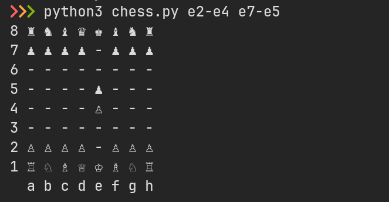

 Шахматы
 =======

 `chess.py` — это консольный скрипт, который проигрывает шахматные партии.
 Он принимает на вход ходы игроков в качестве аргументов и выводит состояние доски
 с расположением фигур после этих ходов.

 Пример:

    python3 chess.py e2-e4 e7-e5

 

 Валидация:

 В текущем виде `chess.py` никак не проверяет корректность шахматных ходов.
 И вам НЕ нужно реализовывать все правила игры.

 Добавьте только те проверки, которые требуются для задач ниже.

 ## Задача 1

 Задача 1: измените код так, чтобы скрипт выбрасывал исключение,
 если нарушен порядок ходов игроков (например, если белые ходят дважды подряд).

 Чтобы проверить решение, запустите тесты:

    python3 test_rotation.py

 ## Задача 2

 Задача 2: измените программу так, чтобы она выбрасывала исключение,
 если пешка делает недопустимый ход.

 Чтобы проверить решение, запустите тесты:

    $ python3 test_pawn.py

 Тесты проверяют только ходы пешек, другие фигуры не двигаются,
 поэтому можно смело игнорировать всё, что не относится к пешкам.

 ### Правила хода пешкой

  * Пешка может ходить вперёд (по вертикали) на 1 клетку;
  * При первом ходе пешка может пойти вперёд на 2 или на 1 клетку;
  * Пешки не могут перепрыгивать через другие фигуры;
  * Пешки могут бить фигуры соперника только по диагонали на 1 клетку вперёд;
  * Существует взятие на проходе, но его реализовывать не требуется :)
